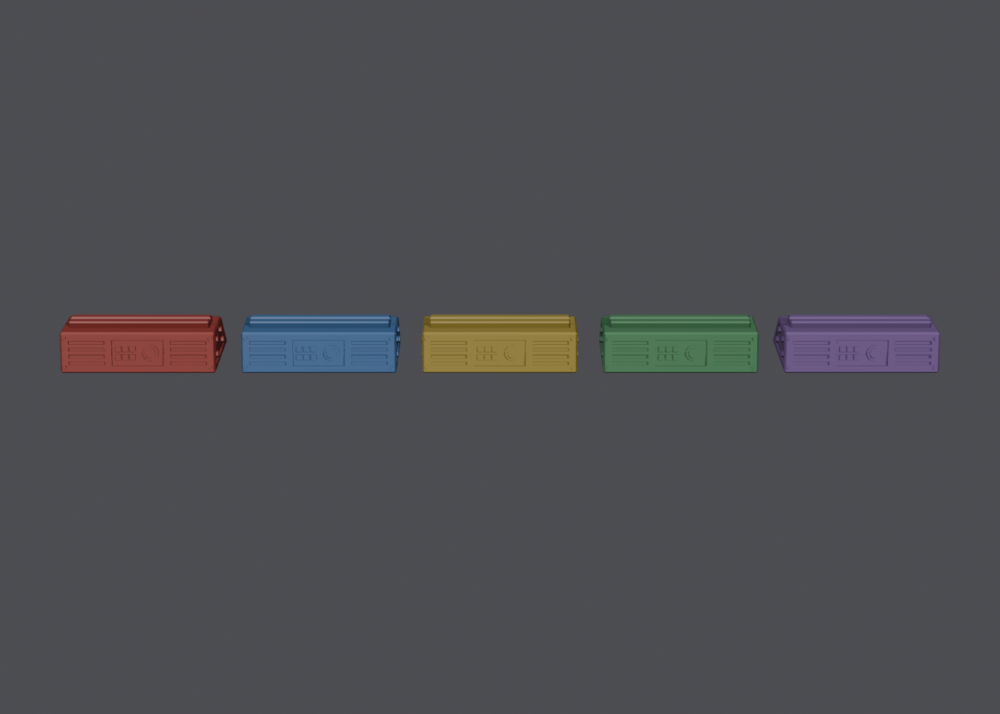

# Star Wars table-sign bases

Low-profile "used future" slotted bases for tournament table signs. Each base
is 90 × 40 mm on the table and 26 mm tall. It holds a laminated 4×6" card
upright in a 16 mm-deep slot. The slot runs out both ends, so the 4" (102 mm)
card can overhang by about 6 mm on each side. Both sloped faces have a recessed
control panel (a keypad and a two-ring dial), with vents on the front and conduit pipes on
the back. The ends have hex bolts. Every table uses the same base. The card
shows the table number.



## Files

| Folder | Use with |
| --- | --- |
| `stl/slot-1.0mm/` | laminated cardstock (3–5 mil pouches) |
| `stl/slot-2.3mm/` | 1/16" (1.6 mm) or 2 mm acrylic, or a card in a stiff sleeve |

Each folder has one file, `table-base.stl`. Print it once for each table.

To regenerate it with a different slot width (Blender 5.0):

```bash
blender -b --factory-startup -P make_bases.py -- --slot 1.0 --render
```

## Printing

- Print flat on the bed exactly as exported. No supports needed.
- 0.2 mm layers, 3 walls, 15–20% infill. About 25–30 g of PLA each.
- Print a test first. If the card is loose, reprint with `--slot 0.8`. If it's
  too tight, use `--slot 1.2`.
- Color-code by filament: Red Leader, Blue Squadron, Gold Leader, and so on.
  For the weathered look, apply a black wash and then dry-brush silver over the
  vents, rivets and number plate.

## Cards

`python make_cards.py` draws each card as a vector PDF, with all text converted to
outlines so the printer doesn't need any fonts. It writes to `cards/`:

- `print/table-cards-print.pdf`: all 12 cards as 4.25×6.25" pages. That's the
  4×6" card plus 1/8" bleed on each side, with the TrimBox and BleedBox set.
  Send this file to a professional printer.
- `print/table-NN-name.pdf`: the same cards, one file each, for printers that
  want one design per upload.
- `table-cards-4x6.pdf`: vector pages already trimmed to 4×6", for printers
  that take 4×6 cardstock.
- `table-cards-letter.pdf`: two cards per Letter sheet with crop marks, for
  home printing.
- `jpg/table-NN-name.jpg`: 1200×1800 at 300 dpi, for photo labs.

Everything is RGB. The printer converts to CMYK, so the brightest accents
(pink, cyan, violet) may print a little duller than they look on screen.

Table names, colors, the review URL and the logo path are at the top of the
script. The text uses Monofonto. The bottom 16 mm of each card is filler hazard
stripes, because the base's slot hides that strip. Laminate the cards in matte
5 mil pouches.

## Mockups

`blender -b --factory-startup -P make_mockups.py -- --tables 11` renders a Cycles
hero shot and a close-up of the base to `mockups/`. The base in these renders has a
light dark wash in the recesses. Use `--tables all` to render
every table, which takes about 3 minutes per table on an RTX GPU.
